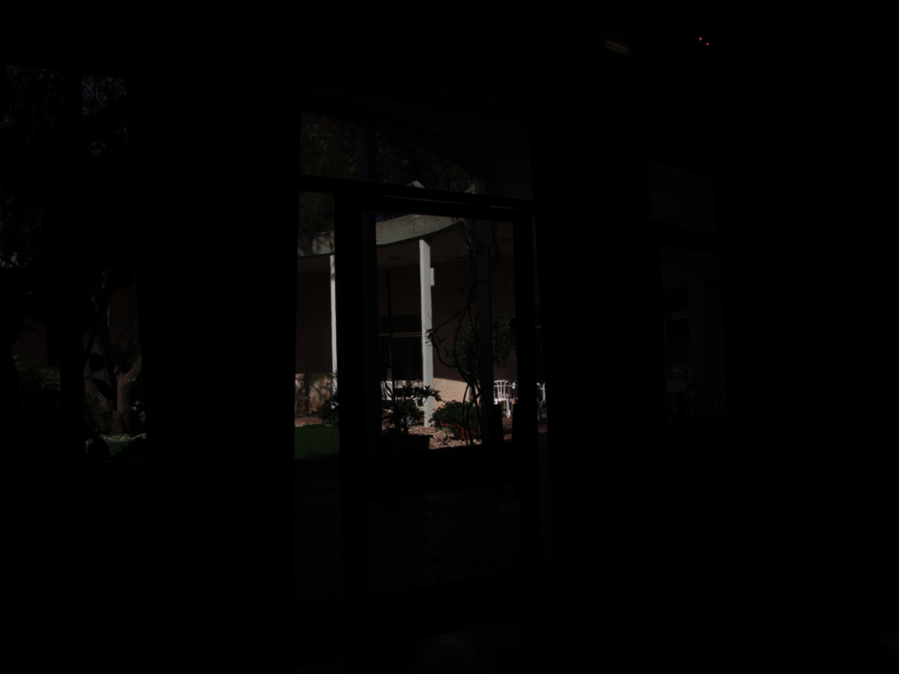
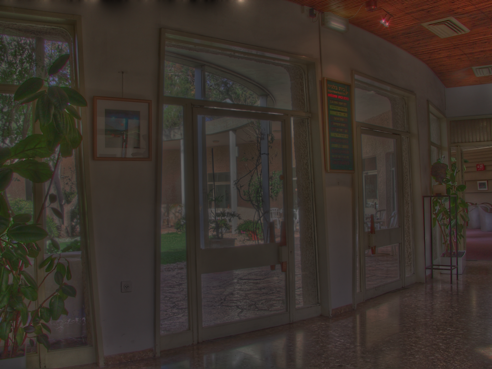

# HDRC
Implementation of Gradient Domain HDR Compression in CUDA.

Linear.

 

Gamma

 

Gradient Domain Compression

Attenuation map of the Belgium House scene.

### References
Fattal, R., Lischinski, D., & Werman, M. (2023). _Gradient domain high dynamic range compression._ In Seminal Graphics Papers: Pushing the Boundaries, Volume 2 (pp. 671-678).
