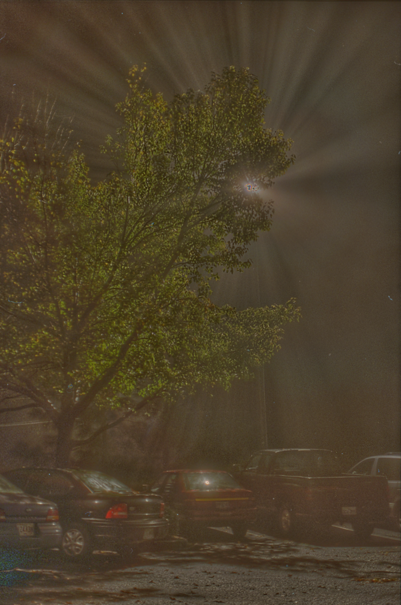

# HDRC
Implementation of Gradient Domain HDR Compression in CUDA.

Gamma vs Gradient Domain Compression

  

Attenuation map of the Belgium House scene.


## Poisson Solver
Install the poisson solvers as a Python package (PyTorch is required)
```
cd poisson_solvers
pip install .
```
Check hdrc.py for sample usage.

Debug the poisson solvers
```
cd poisson_solvers
nvcc -O2 debug.cu debug_function2D.cu solvers.cu -o debug
```
method:
- 0 : Jacobi
- 1: Gauss-Seidel
- 2: Gauss-Seidel + Naive Red-Black + SOR
- 3: Gauss-Seidel + Pre-Reordered Red-Black
- 4: Gauss-Seidel + Pre-Reordered Red-Black + SOR
- 5: V-Cycle
- 6: W-Cycle
- 7: F-Cycle (Full Multigrid)

warmup: 0 for testing. 5 for measuring.

measure: 1 for testing. 20 for measuring.

### Single-Grid Method (method <= 4)
```
.\debug {$method} {$warmup} {$measure} 10000 500 0.00001
```

### Multigrid Method (method > 4)
```
.\debug {$method} {$warmup} {$measure} 100 5 0.00001 4 3 2 10000 500 0.00001
```


## Remarks
1. The code is only tested on (H = 1200, W = 1600) and the two sample .hdr images.
2. The code is tested on Windows 10, Python 3.7, CUDA Toolkits 11.8 with a NVIDIA 4060Ti GPU.

## References
Fattal, R., Lischinski, D., & Werman, M. (2023). _Gradient domain high dynamic range compression._ In Seminal Graphics Papers: Pushing the Boundaries, Volume 2 (pp. 671-678).

Course 18.086: Mathematical Methods for Engineers II (Spring 2006 MIT). Section 6.2 and 6.3. [website](https://math.mit.edu/classes/18.086/2006/).