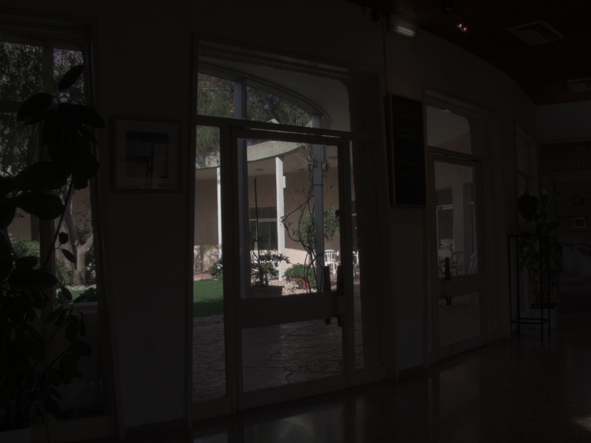
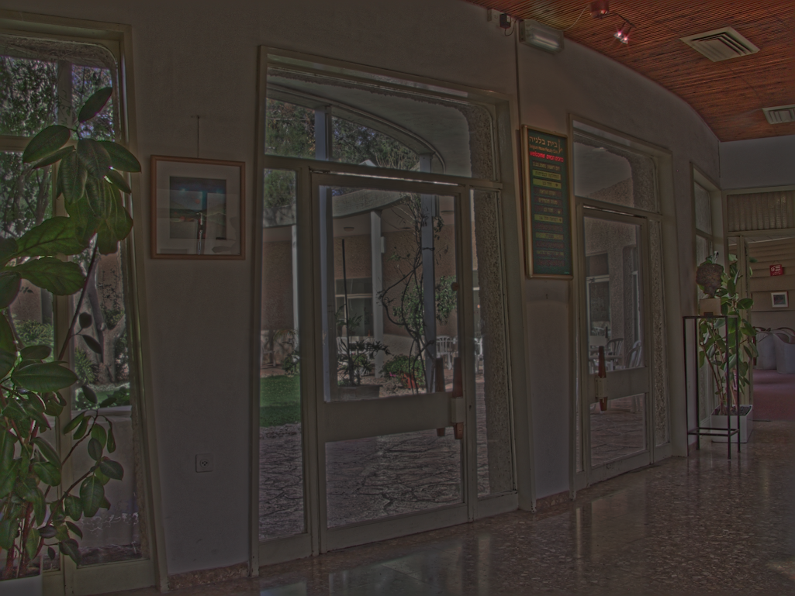
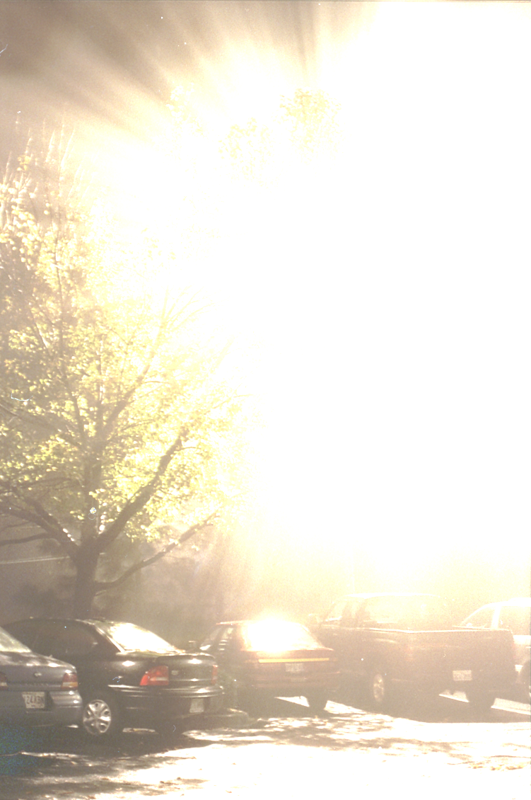
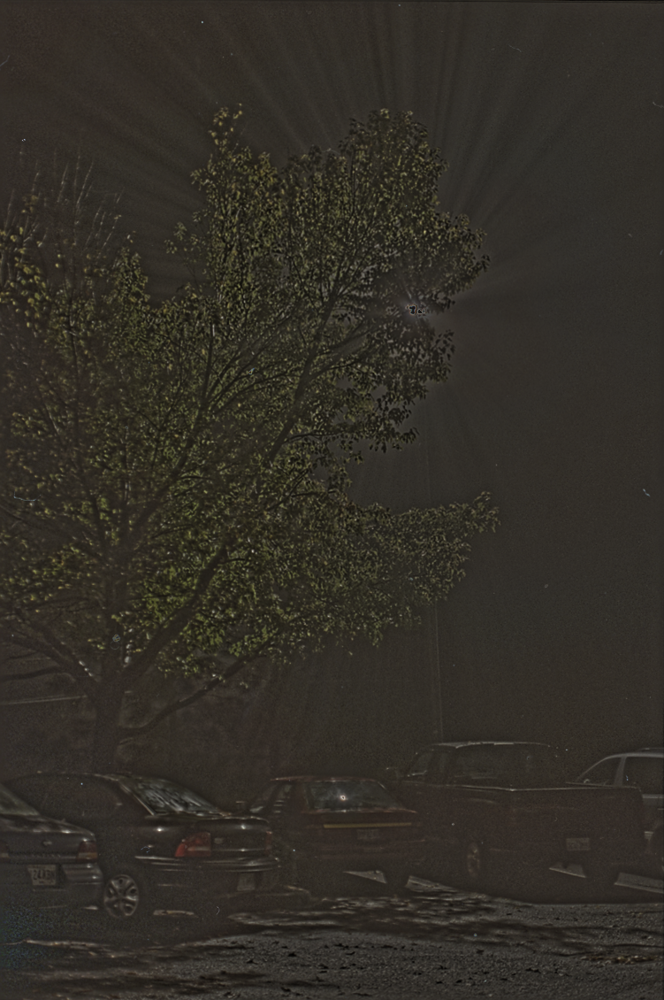
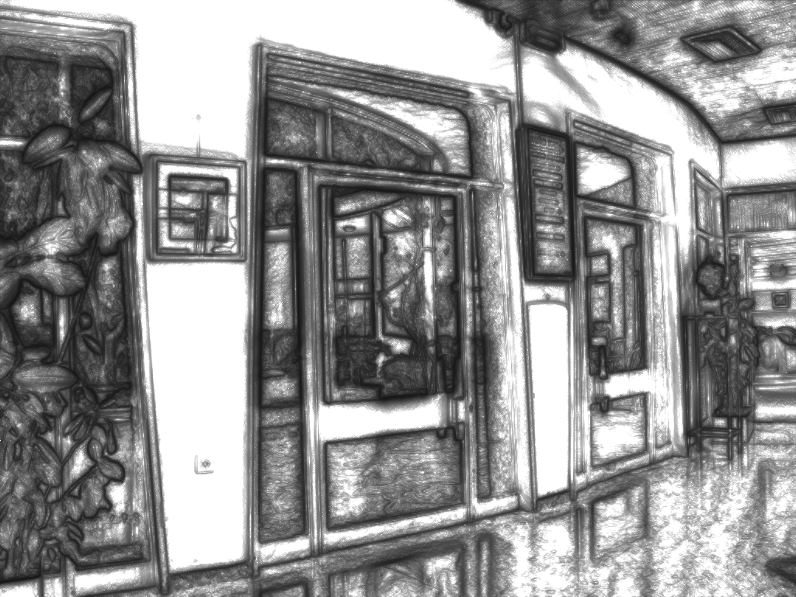
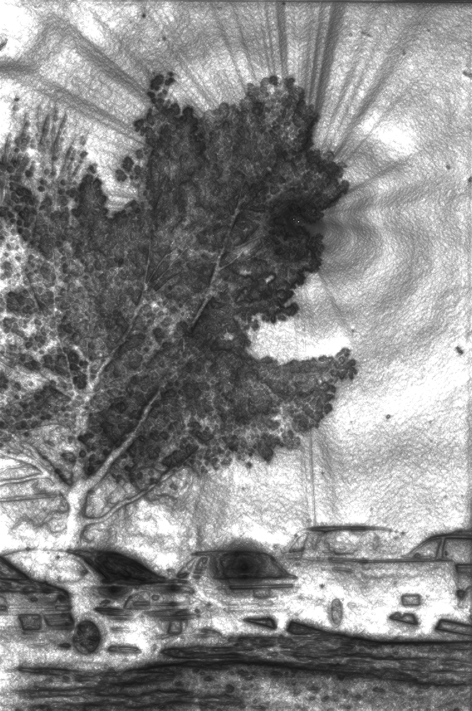

# Gradient Domain HDR Compression in CUDA

This is Runfeng's final project for APMA2822B Introduction to Parallel Computing and part of his final project for CSCI1290 Computational Photography at Brown to enable fast HDR tonemapping for real-time novel HDR view synthesis with 3DGS.

The current best performance is about 150 milliseconds for the sample images in data folder. Unfortunately, this simple parallelization has not achieved real-time performance, though many parts could still be improved.

Gamma vs Gradient Domain Compression (V-Cycle)

  

  

Attenuation maps.





## All CUDA HDRC
Install the entire HDRC pipeline as a Python package (PyTorch is required)
```
pip install .
```
The package name is hdrc. Check main_cuda.py for sample usage.

## Only CUDA Poisson Solver
Install the poisson solvers as a Python package (PyTorch is required)
```
cd poisson_solvers
pip install .
```
The package name is poisson-solvers. Check main_python.py for sample usage.

Debug the poisson solvers
```
cd poisson_solvers
nvcc -O2 debug.cu debug_function2D.cu solvers.cu -o debug
```
method:
- 0: Jacobi
- 1: Gauss-Seidel
- 2: Gauss-Seidel + Naive Red-Black + SOR
- 3: Gauss-Seidel + Pre-Reordered Red-Black
- 4: Gauss-Seidel + Pre-Reordered Red-Black + SOR
- 5: V-Cycle
- 6: W-Cycle
- 7: F-Cycle (Full Multigrid)

warmup: 0 for testing. 5 for measuring.

measure: 1 for testing. 20 for measuring.

### Single-Grid Method (method <= 4)
```
.\debug {$method} {$warmup} {$measure} 10000 500 0.00001
```

### Multigrid Method (method > 4)
```
.\debug {$method} {$warmup} {$measure} 10 2 0.00001 4 10 5 10000 100 0.00001
```

## Remarks
1. The code is tested on Windows 10, Python 3.7, CUDA Toolkits 11.8 with a NVIDIA 4060Ti GPU.
2. Recovering the sample function (sin(pi/100*(x+y))) used for dubugging purpose may not benefit from using multigrid methods, because the grid elements have the same frequency. Multigrid methods would be beneficial if we have different frequencies of signals in the grid.
3. Because sending the divG to the device (GPU) would be very time consuming, about 100 milliseconds, but solving the poisson equation only needs <10 milliseconds, and if we want to apply this code as part of a real-time tonemapper which tonemaps RAW HDR images to LDR images in real-time on GPU, the "divG" in that case would already be on GPU --> We ignore the large amount of time spent on sending divG to GPU in the Python part. Instead, we measure the time spent on solving the poisson equation in the pycall.cu file.
4. The default parameters in main.py should produce the best result I could get for both the Belgium and bigFogMap scenes. I normalized the luminance after solving the poisson equation. This may be the reason why we can't see the large reflections on the car's windows in the bigFogMap scene, but not doing this would produce very bright result for the bigFogMap scene. More efforts should be made on finetuning the parameters and the way to get output.
5. The multigrid methods may have better results if optimized on CPU.

## References
Fattal, R., Lischinski, D., & Werman, M. (2023). _Gradient domain high dynamic range compression._ In Seminal Graphics Papers: Pushing the Boundaries, Volume 2 (pp. 671-678).

Course 18.086: Mathematical Methods for Engineers II (Spring 2006 MIT). Section 6.2 and 6.3. [website](https://math.mit.edu/classes/18.086/2006/).